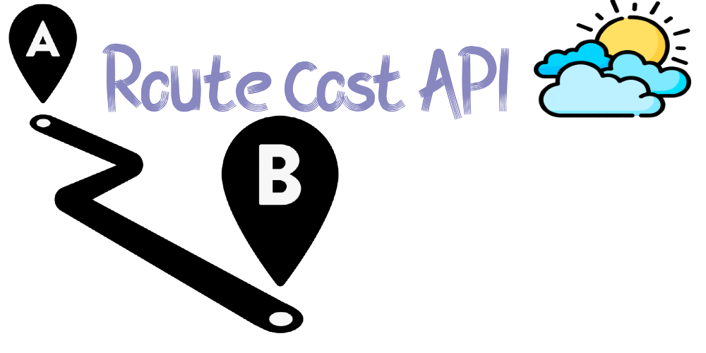
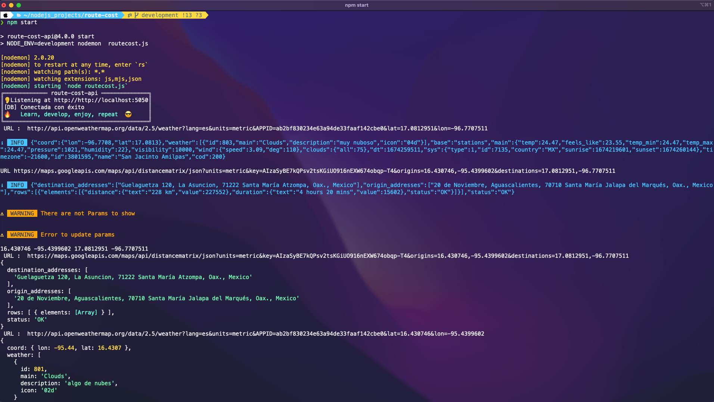
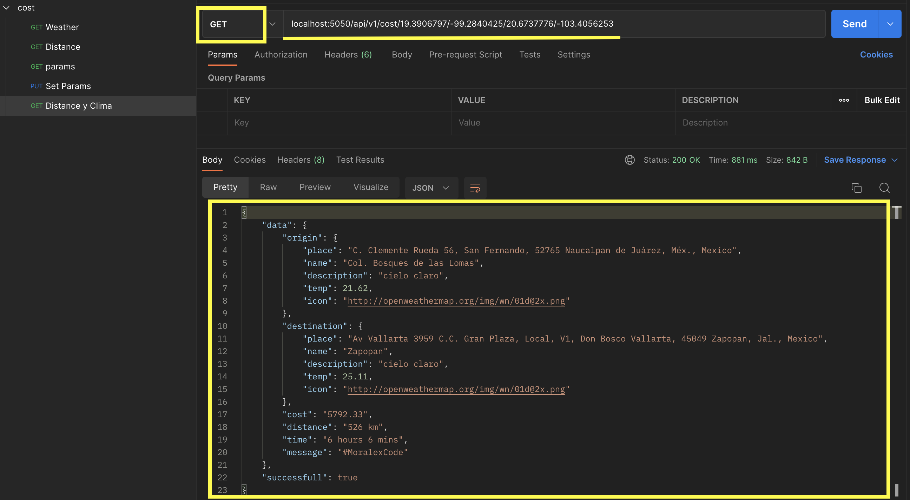
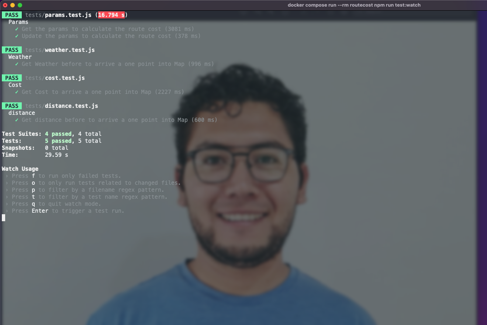

# RouteCost

 



# Descripción

Esta API REST sirve para obtener la distancia, el clima de un punto **A** un punto **B ** y ademas calcula el costo que implica desplazarse.

This API REST get the score and data of any route , in otherwise is the route cost computing.

Puedes obtener mas informacion en mi pagina web : 



# Caracteristicas

-   Obtiene el clima de un determinado lugar
-   Calcula la distancia de un punto **A** a un punto **B**
-   Genera elcosto que implica desplazarce entre ambos puntos.
-   Obtener y actualizar los parametros

# Instalación y configuración:

Para instalar el proyecto se debe seguir lo siguientes pasos.

```
    git clone https://github.com/MoralexCode/route-cost-api.git
```

Entras al proyecto y crea un archivo .env en la raiz del proyecto
dentro del archivo .env agregar la siguientes variables de entorno

```
APIKEY=Clave  de la api google
APPID=id de la aplicacion de openweathermap
MAPS_URL=https://maps.googleapis.com/maps/api/distancematrix/json?units=metric&key=
WEATHER_ZIP_CODE_URL=http://api.openweathermap.org/data/2.5/weather?lang=es&units=metric&
WEATHER_CONDITIONS=https://openweathermap.org/weather-condition
MONGODB_URL=URL de la base de datos de MongoDB, si utilizas MongoAtlas u otro servicio de Mongo en la nube
HOST=http://localhost
```


Si tienes docker instalado puedes ejecutar el siguiente comando:

```
    docker compose up --build
```

De lo contrario ejecuta este correrlo dentro de tu equipo local

```
    npm i
```

y despues

```
    npm start
```

# Cómo usar:

Una vez descargado, puedes ejecutar el siguiente endpoint en un cliente rest, te recomiendo que importes las siguientes petciones curl o tambien lo puedes ejecutar en una terminal directamente si lo deseas:

**Clima**

```
    curl --location --request GET 'localhost:5050/api/v1/weather/20.6737776/-103.4056253'

```

> Respuesta

```
    {
        "data": {
            "coord": {
                "lon": -103.4056,
                "lat": 20.6738
            },
            "weather": [
                {
                    "id": 800,
                    "main": "Clear",
                    "description": "cielo claro",
                    "icon": "01d"
                }
            ],
            "base": "stations",
            "main": {
                "temp": 25.11,
                "feels_like": 24.41,
                "temp_min": 25.11,
                "temp_max": 25.44,
                "pressure": 1018,
                "humidity": 28
            },
            "visibility": 10000,
            "wind": {
                "speed": 5.66,
                "deg": 260
            },
            "clouds": {
                "all": 0
            },
            "dt": 1674340791,
            "sys": {
                "type": 2,
                "id": 268566,
                "country": "MX",
                "sunrise": 1674307939,
                "sunset": 1674347826
            },
            "timezone": -21600,
            "id": 3979770,
            "name": "Zapopan",
            "cod": 200
        },
        "successfull": true
    }
```

**Distancia**

```
    curl --location --request GET 'localhost:5050/api/v1/distance/19.3906797/-99.2840425/20.6737776/-103.4056253'
```

> Respuesta

```
    {
        "data": {
            "destination_addresses": [
                "Av Vallarta 3959 C.C. Gran Plaza, Local, V1, Don Bosco Vallarta, 45049 Zapopan, Jal., Mexico"
            ],
            "origin_addresses": [
                "C. Clemente Rueda 56, San Fernando, 52765 Naucalpan de Juárez, Méx., Mexico"
            ],
            "rows": [
                {
                    "elements": [
                        {
                            "distance": {
                                "text": "526 km",
                                "value": 526394
                            },
                            "duration": {
                                "text": "6 hours 6 mins",
                                "value": 21975
                            },
                            "status": "OK"
                        }
                    ]
                }
            ],
            "status": "OK"
        },
        "successfull": true
    }
```

**Clima, distancia y el costo**

```
    curl --location --request GET 'localhost:5050/api/v1/cost/19.3906797/-99.2840425/20.6737776/-103.4056253'
```

> Respuesta

```
    {
        "data": {
            "origin": {
                "place": "C. Clemente Rueda 56, San Fernando, 52765 Naucalpan de Juárez, Méx., Mexico",
                "name": "Col. Bosques de las Lomas",
                "description": "cielo claro",
                "temp": 21.62,
                "icon": "http://openweathermap.org/img/wn/01d@2x.png"
            },
            "destination": {
                "place": "Av Vallarta 3959 C.C. Gran Plaza, Local, V1, Don Bosco Vallarta, 45049 Zapopan, Jal., Mexico",
                "name": "Zapopan",
                "description": "cielo claro",
                "temp": 25.11,
                "icon": "http://openweathermap.org/img/wn/01d@2x.png"
            },
            "cost": "5792.33",
            "distance": "526 km",
            "time": "6 hours 6 mins",
            "message": "#MoralexCode"
        },
        "successfull": true
    }
```

En mi caso uso Postman y las respuestran así:


# Claves invalidas

###### Si usted provee claves invalidas tendrá errores como este :

```

    {
        destination_addresses: [],
        error_message: 'The provided API key is invalid.',
        origin_addresses: [],
        rows: [],
        status: 'REQUEST_DENIED'
    }
```

```
    {
        "response": {
            "destination_addresses": [],
            "error_message": "You must enable Billing on the Google Cloud Project at https://console.cloud.google.com/project/_/billing/enable Learn more at https://developers.google.com/maps/gmp-get-started",
            "origin_addresses": [],
            "rows": [],
            "status": "REQUEST_DENIED"
        },
        "successfull": true
    }
```

Para evitar esto, usted deberia crear una cuenta el [openweathermap](http://openweathermap.org) y en su cuenta de google, ir a la consola y crear un proyecto para obtener al API KEY.

# Test

Para correr los test usando docker, pueden ejecutar el siguiente comando:

```
docker compose run --rm routecost npm run test:watch
```


De lo contrario solo ejecutar :

```
    npm run test
```

## Licencia

MIT

# Conclusión

Este es mini proyecto que fué utilizado para calcular el costo de desplazarce de un punto A un punto B dentro de una ciudad para saber cuanto nos costaria ir al domicilio de la persona que solicita el servicio.

Dudas y comentarios me puedes contactar a este correo: [oscarmorales.fullstackdeveloper@gmail.com](oscarmorales.fullstackdeveloper@gmail.com)


